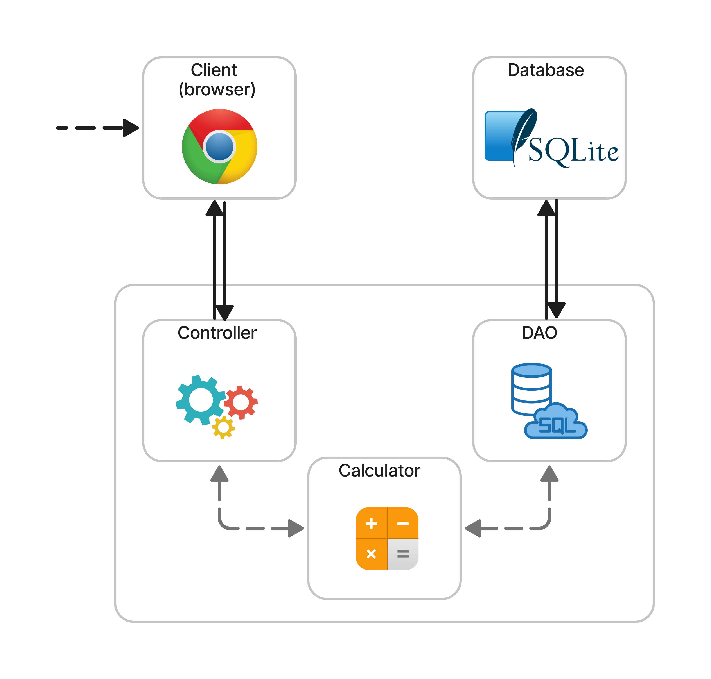
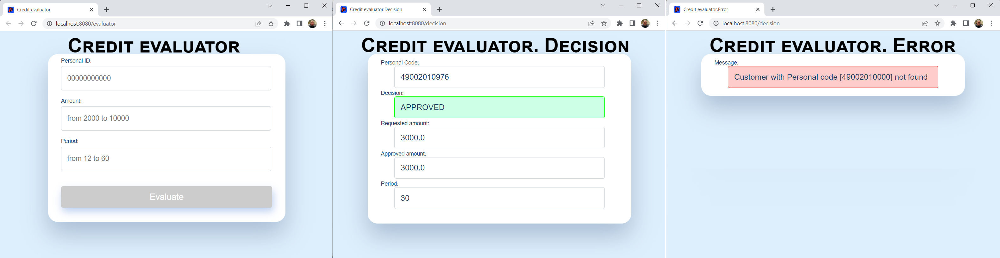

# Credit evaluator

## Task
Please design a decision engine which takes in personal code, loan amount, loan period in
months and returns a decision (negative or positive) and the amount.

The idea of the decision engine is to determine what would be the maximum sum, regardless of
the person requested loan amount. For example if a person applies for 4000 €, but we determine
that we would approve a larger sum then the result should be the maximum sum which we
would approve. Also in reverse, if a person applies for 4000 € and we would not approve it then
we want to return the largest sum which we would approve, for example 2500 €. 

If a suitable loan amount is not found within the selected period, the decision engine should also try to find a new
suitable period. 

In real life the solution should connect to external registries and compose a
comprehensive user profile, but for the sake of simplicity this part can be mocked as a hard
coded result for certain personal codes. As the scope of this solution you only need to support 4
different scenarios - a person has debt or a person falls under a different segmentation.
## Segmentation

| Personal code | Crdit modifier | Description |
|---------------|---|-------------|
| 49002010965| 0 | Debt |
| 49002010976 | 100 | Segment 1 |
| 49002010987 |300 | Segment 2 |
| 49002010998 | 1000 | Segment 3 |

## Constraints:
Minimum input and output sum can be 2000 €
Maximum input and output sum can be 10000 €
Minimum loan period can be 12 months
Maximum loan period can be 60 months
Scoring algorithm. For calculating credit score a really primitive algorithm should be
implemented. You need to divide the credit modifier with the loan amount and multiply the
result with the loan period in months. If the result is less than 1 then we would not approve such
sum, if the result is larger or equal than 1 then we would approve this sum.
credit score = (credit modifier / loan amount) * loan period
As a result please provide working code with a single api endpoint and front-end application
which uses the functionality. 

## Architecture 

 

Customer calls web form in the browser.
He/she enters Personal code with 11 symbols, desired loan amount and period.
Then he/she submit request to controller by pressing button submit.

Controller sends to calculator customer data. 

Calculator submits request to Database via Dao with personal code to get Credit modifier.

> In this case, SQLite is used as database.

In case if Credit modifier is 0, that's mean that customer has debt, customer get declined. 

In case of Credit modifier is gather than 0 trying to find maximum available amount. 

>Amount = Credit modifier * Period

If we received an amount greater than the maximum possible (10 000 €) then we return approve to  the maximum possible amount 10 000 €.

If we received an amount less than minimum possible (2 000 €) we try to find new possible period for requested amount 
and then for minimal amount. If alternative period not found customer gets declined. 

> Period = Amount/Credit modifier

If an error occurs, the client will receive a message on the UI. 

## User interface 

